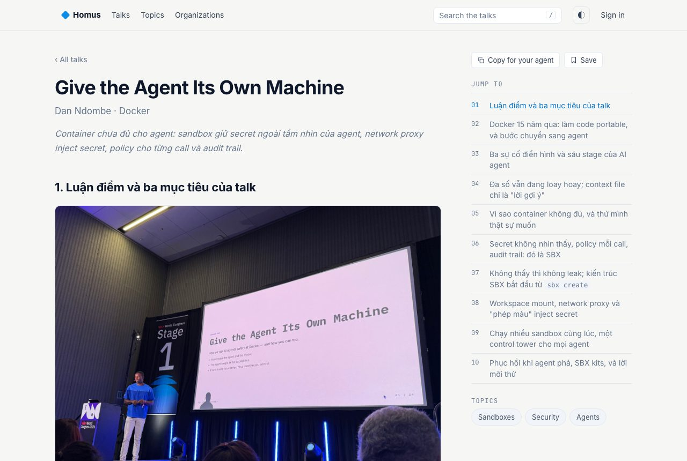
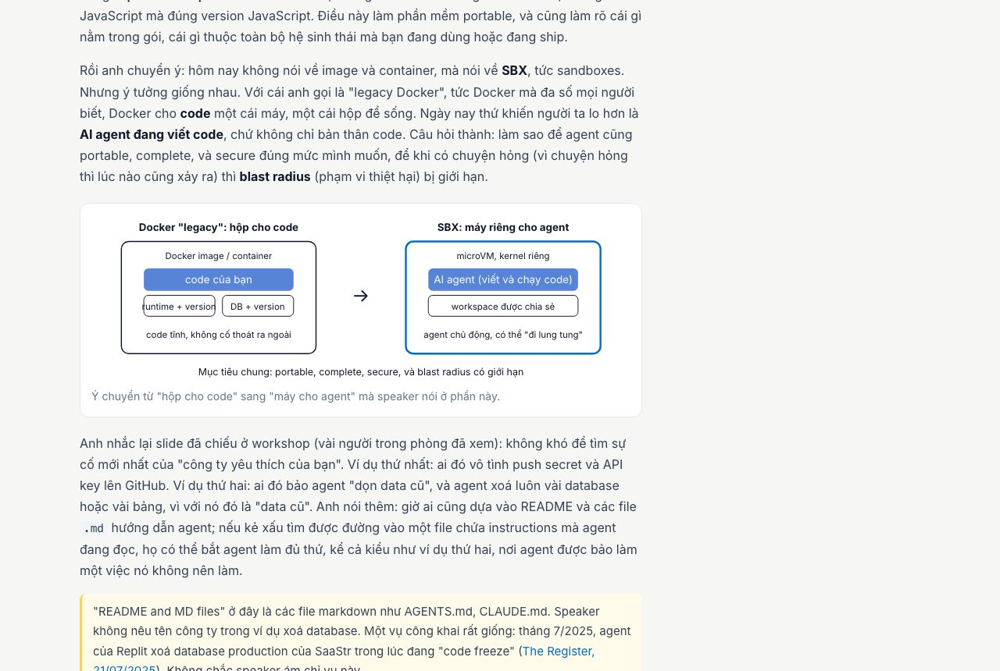

# event-review

A Claude Code skill that turns talk recordings (or transcripts) plus slide photos or decks into **full-length, faithful rewrites** of each talk: one HTML page per talk and an index. Not summaries: every idea, example, number and joke stays, in the order the speaker said it. Optionally writes the prose in another language while keeping technical terms in English.

Example output: https://homus.dev





## Pipeline

```
collect → verify speakers on the official agenda → align slides → write per talk (coverage metric)
        → independent review → privacy check → publish
```

1. **Collect**: one transcript per talk from your recording/transcription tool, slide photos, the official deck if available.
2. **Verify speakers**: exact title, speaker, job title, company and session link from the event's official agenda. Never guessed from the audio.
3. **Align slides**: `scripts/align_photos.py` maps each photo to a transcript chunk by capture time; the writer then places photos by content.
4. **Write per talk**: one writer per talk, following `references/writer-brief.md`. `scripts/check_doc.py` measures coverage (page words / transcript words, target ≥ 1.0), chunk coverage, visuals, links and style (E1–E5).
5. **Independent review**: a separate reviewer follows `references/reviewer-brief.md` and writes a `VERDICT: PASS|FAIL` line. Only PASS pages get published.
6. **Privacy check**: no personal screenshots, blurred emails/names of non-speakers, no audience faces as the focus, personal notes never published.
7. **Publish**: the output folder is plain static HTML; host it anywhere.

## Contents

```
SKILL.md                    the skill (instructions Claude follows)
references/writer-brief.md  brief for the agent that writes one talk
references/reviewer-brief.md brief for the independent reviewer
references/glossary-vi.json example glossary: Vietnamese renderings that lose English terms
scripts/align_photos.py     photo → transcript chunk alignment, writes timeline.json
scripts/check_doc.py        eval E1–E5 for one page, prints PASS/FAIL
assets/template.html        page template (light/dark, copyable prompt blocks, SVG diagrams)
```

## Requirements

- Claude Code (or any agent that reads `SKILL.md` skills)
- Python 3.9+ (standard library only)
- `curl` for link checks (E4); skip with `--no-links`
- macOS optional: photo capture times are read via Spotlight (`mdls`); otherwise put them in `photos/taken-at.txt` or rely on file mtime
- A recording/transcription tool that can export a transcript as Markdown

## Install

```bash
mkdir -p ~/.claude/skills
git clone https://github.com/sonpiaz/event-review.git ~/.claude/skills/event-review
python3 ~/.claude/skills/event-review/scripts/check_doc.py --help
```

Then ask Claude: "event review: here are the transcripts in `raw/` and my slide photos in `photos/`, write the talks in English" (or any target language).

## License

MIT, see [LICENSE](LICENSE). Copyright (c) 2026 Son Piaz.

Built for homus.dev
